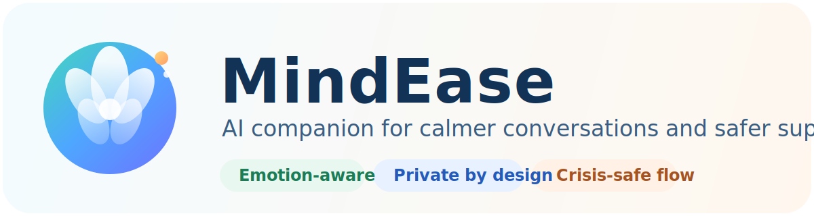
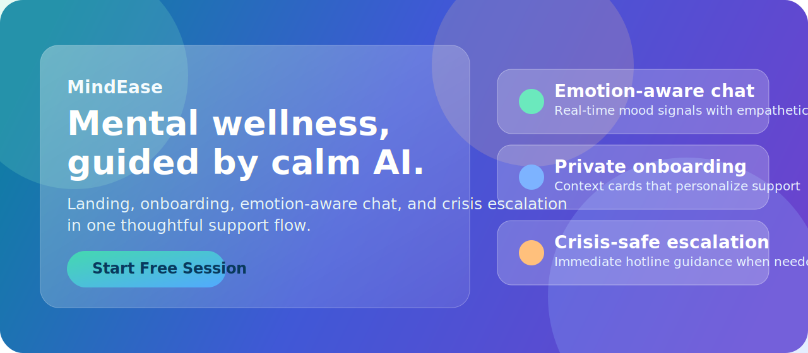
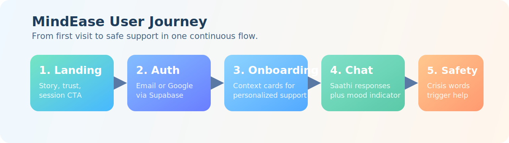

<div align="center">
	
</div>

<div align="center">
	
	
	
	
	
</div>

<div align="center">
	
</div>

## Project Description

MindEase is an AI-powered mental wellness web application designed to offer calm, supportive conversations with a virtual companion named Saathi.

The platform combines:

- Emotion-aware chat responses
- Personalized onboarding questions
- Real-time mood indicators
- Crisis escalation support when urgent language is detected

MindEase is built as a full modern frontend experience with React, TypeScript, Tailwind CSS, and Supabase authentication.

## Why MindEase

Mental wellness support should be accessible, private, and immediate.

MindEase helps users:

- Talk through stress at any time
- Receive empathetic AI responses in a safe flow
- Track emotional tone across conversations
- Get immediate safety guidance during high-risk moments

## User Journey

<div align="center">
	
</div>

1. Landing page introduces product value and trust.
2. Users sign in with email/password or Google.
3. Onboarding captures emotional context.
4. Chat interface delivers supportive responses with mood feedback.
5. Crisis trigger phrases redirect users to emergency support resources.

## Core Features

| Feature | What It Does |
| --- | --- |
| Emotion-Aware Chat | Detects tone in user messages and adjusts response style. |
| Saathi Companion | Simulated AI companion flow for warm, human-like pacing. |
| LED Mood Indicator | Visual mood signal that changes with conversation sentiment. |
| Crisis Escalation | Detects high-risk phrases and shows immediate hotline guidance. |
| Protected Routes | Restricts private pages behind authenticated sessions. |
| Session-Centric UX | Smooth navigation between onboarding, chat, profile, and history. |

## Tech Stack

| Layer | Technologies |
| --- | --- |
| Frontend | React 18, TypeScript, Vite |
| Styling | Tailwind CSS, custom design tokens, animated UI effects |
| Motion | Framer Motion |
| Auth + Data | Supabase |
| UI Toolkit | Radix UI, shadcn-based components |
| Testing | Vitest, Testing Library |

## Folder Overview

```text
src/
	components/
		auth/
		chat/
		hero/
		layout/
		onboarding/
		sections/
		session-history/
		ui/
	context/
	hooks/
	lib/
	pages/
	utils/
```

## Quick Start

### 1) Install dependencies

```bash
npm install
```

### 2) Create environment file

Create a `.env` file in the project root with:

```bash
VITE_SUPABASE_URL=your_supabase_url
VITE_SUPABASE_PUBLISHABLE_DEFAULT_KEY=your_supabase_anon_key
```

### 3) Run local development server

```bash
npm run dev
```

### 4) Build for production

```bash
npm run build
```

## Scripts

| Command | Description |
| --- | --- |
| `npm run dev` | Starts Vite dev server |
| `npm run build` | Creates production build |
| `npm run preview` | Serves production build locally |
| `npm run lint` | Runs ESLint checks |
| `npm run test` | Runs test suite once |
| `npm run test:watch` | Runs tests in watch mode |

## Privacy and Safety Notes

- Keep secrets only in local `.env` files.
- Do not commit credentials or API keys.
- Crisis support should always present local emergency resources.

## Acknowledgements

MindEase combines product design, empathy-first interaction patterns, and modern web tooling to create a thoughtful digital support space.
